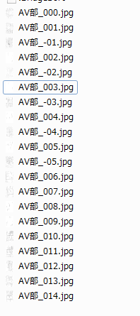
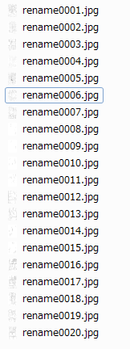

# cspRenameImgs

clip studio paint の画像出力ファイルからPDFファイルを作成します  
見開きファイルを出力したばあい、ファイル名連番が負の数でついていると問題なので修正してから出力します
  
BEFORE
  
AFTER
  

imagesToPdf.exe  
実行ファイル化化したもの　PDF化までやります （要 Image Magick)  
cspRenameImages.exe  
連番をなおすだけ
